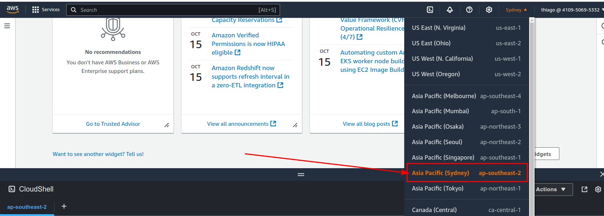

# 🪵 Karpenter

## Understand key concepts of Karpenter

Karpenter simplifies cluster scaling by launching nodes to accommodate unschedulable pods and terminating them when they are no longer needed. Two fundamental objects in Karpenter are the **NodePool** and the **NodeClass**. This guide explores these concepts from the perspectives of a Kubernetes administrator and a Kubernetes application developer.

<figure><figcaption></figcaption></figure>

## For a Kubernetes Administrator

## **NodePool**

**Definition:** A NodePool in Karpenter is a Kubernetes Custom Resource Definition (CRD) that defines constraints and behaviours for provisioning nodes. It allows administrators to specify how Karpenter should manage unschedulable pods and configure the nodes it provisions.

**Key Responsibilities:**

* **Configuring Constraints:** NodePools enable you to set constraints on node provisioning, such as instance types, availability zones, architectures, and operating systems. By defining these constraints, you control the characteristics of the nodes that Karpenter can provision.
* **Managing Disruption Policies:** NodePools include configurations for node disruption features like consolidation, drift detection, and expiration. For example, you can set `spec.disruption.expireAfter` to automatically recycle nodes after a certain period for security compliance.
* **Multiple NodePools:** You can create multiple NodePools within a cluster to isolate workloads, enforce resource quotas, or apply different configurations for different teams or applications.

**Use Cases:**

* **Resource Optimisation:** By setting specific instance types and sizes, you can optimise resource utilisation and cost.
* **Security Compliance:** Use node expiration and drift detection to ensure nodes meet the latest security standards.
* **Workload Isolation:** Assign different NodePools to different teams or applications to isolate resources and manage quotas effectively.

## **NodeClass**&#x20;

**Definition:** A NodeClass in Karpenter is a resource that encapsulates provider-specific configurations for nodes. It separates node configuration details from NodePool constraints, allowing for cleaner and more reusable configurations. Each NodePool must reference an NodeClass using `spec.template.spec.nodeClassRef`.  Multiple NodePools may point to the same NodeClass. EC2NodeClass enable configuration of AWS specific settings.&#x20;

**Key Responsibilities:**

* **Defining Node Configurations:** NodeClass specifies node-level settings such as AMI IDs, user data scripts, and block device mappings.
* **Provider-Specific Settings:** It contains cloud provider-specific configurations (e.g., AWS-specific settings) that are necessary for node provisioning.
* **Reusability:** By abstracting node configurations into NodeClasses, you can reuse them across multiple NodePools, promoting consistency and reducing duplication.

**Use Cases:**

* **Standardization:** Maintain a consistent node configuration across different NodePools by referencing the same NodeClass.
* **Simplified Management:** Update node configurations in one place, and have those changes propagate to all associated NodePools.

## For a Kubernetes Application Developer

#### **Interacting with NodePool and NodeClass**

As an application developer, your primary interaction with Karpenter is indirect, through the scheduling constraints you define in your pod specifications.

**Key Considerations:**

* **Scheduling Constraints:** You can specify `nodeSelector`, `nodeAffinity`, and `topologySpreadConstraints` in your pod specs to influence where your pods are scheduled.
* **Well-Known Labels:** Use Kubernetes well-known labels like `kubernetes.io/arch`, `node.kubernetes.io/instance-type`, and `topology.kubernetes.io/zone` to request specific node characteristics.
* **Resource Requests:** Define `resources.requests` to ensure your pods have the necessary CPU and memory, which Karpenter will consider when provisioning nodes.

**Interplay with NodePool and NodeClass:**

* **Layered Constraints:** Your pod's scheduling constraints are layered on top of the NodePool's constraints. Karpenter will attempt to provision nodes that satisfy both sets of constraints.
* **Limitations:** If your pod's constraints are too restrictive and cannot be satisfied within the NodePool's configuration, the pod will remain unscheduled. Collaborate with cluster administrators to adjust constraints if necessary.

**Best Practices:**

* **Specify Only Necessary Constraints:** Over-constraining pods can lead to scheduling issues. Specify only the constraints that are essential for your application.
* **Use Tolerations and Affinities Wisely:** Understand how taints, tolerations, and affinities affect pod scheduling to make effective use of Karpenter's provisioning capabilities.


