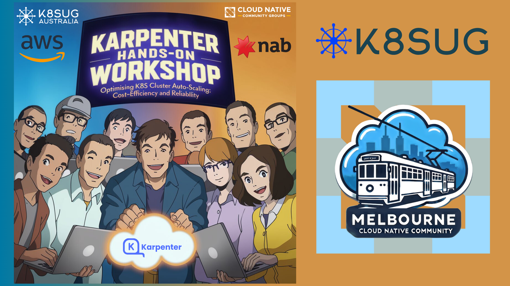

# 🙏 Thank You and Final Notes

Thank you all for attending today's **K8SUG CTL - Hands-on Workshop at NAB** on **Optimizing K8S Cluster Autoscaling with Karpenter: Cost-Efficiency and Reliability**. We hope you gained valuable insights and practical skills that you can apply to your own Kubernetes environments.

We encourage you to explore Karpenter further and continue experimenting with advanced configurations to enhance both performance and cost-efficiency in your clusters.

Thank you again for your participation! We look forward to seeing you at future workshops and K8SUG events! If you have any questions or feedback, feel free to reach out.

Special thanks to Daniel Drentin, NAB and AWS for sponsoring this event.

<figure><figcaption></figcaption></figure>


follow K8SUG on Linkedin


